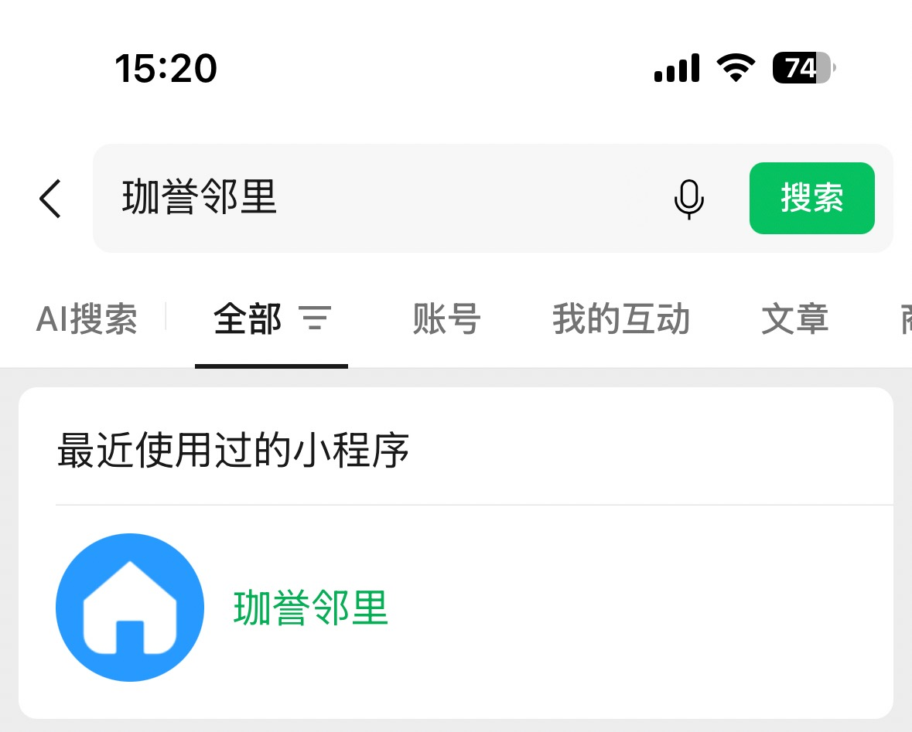
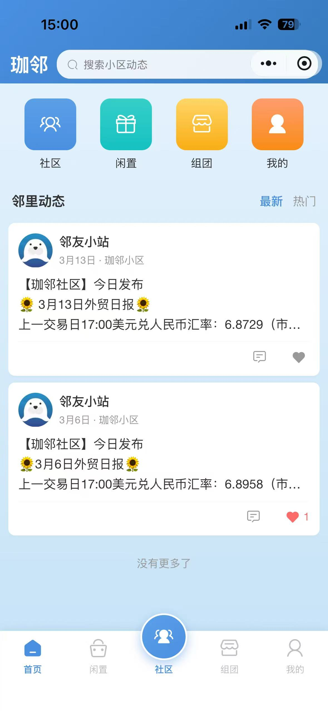
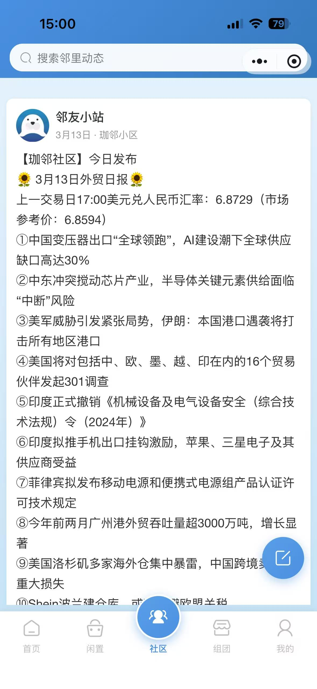
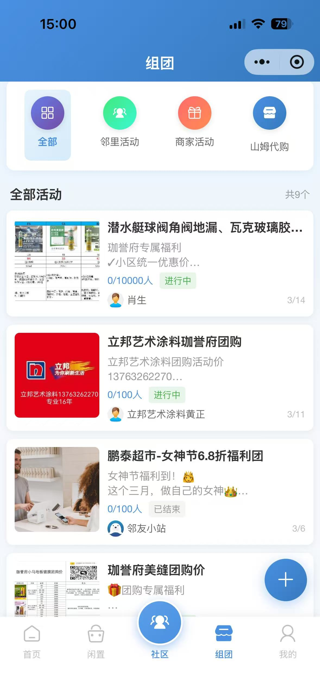
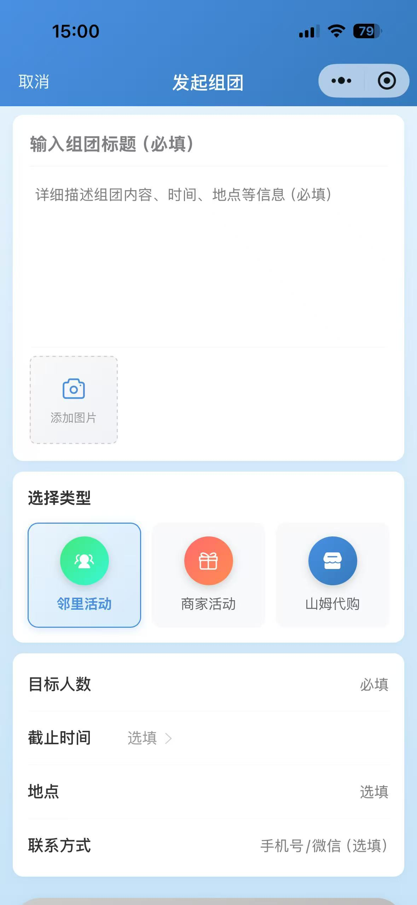
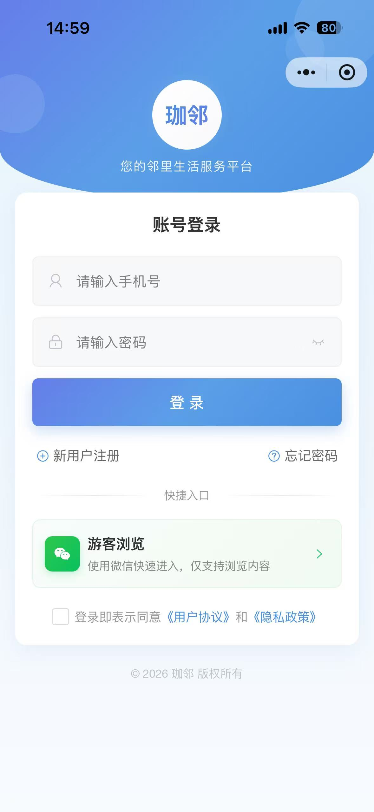
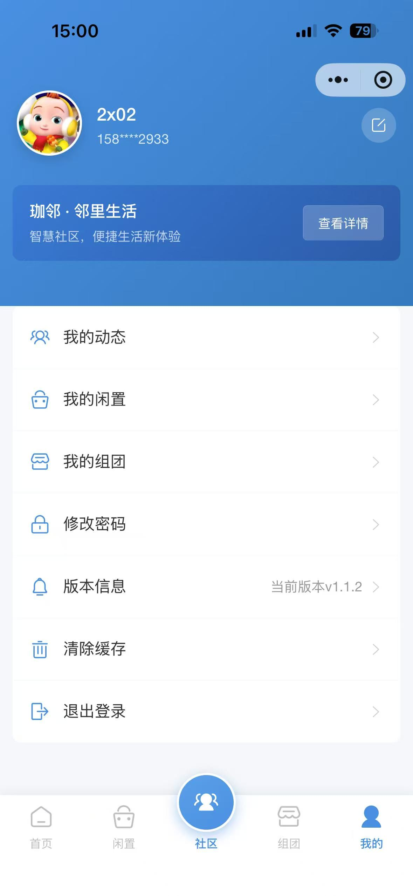
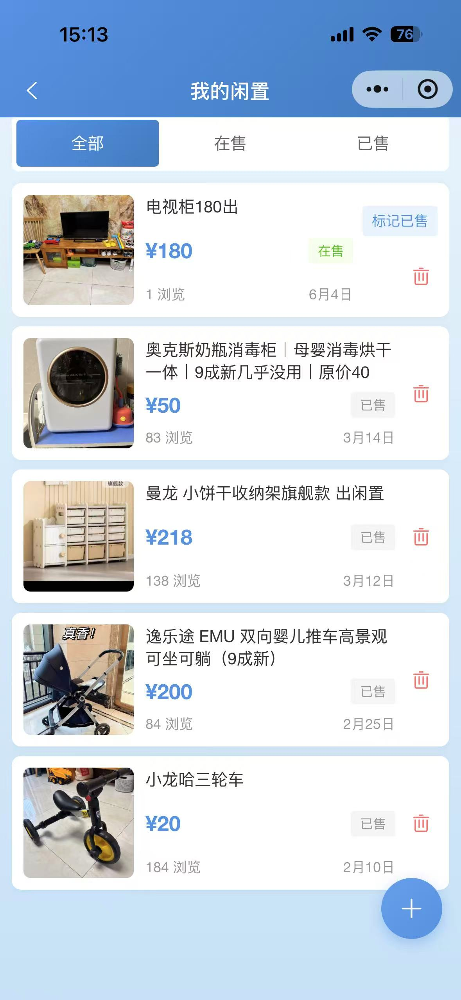
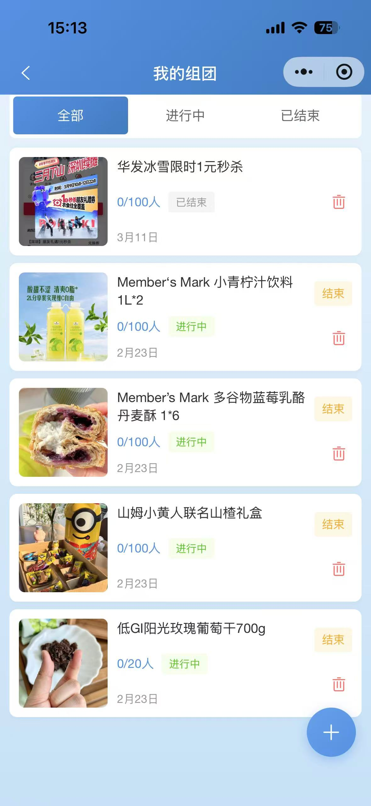

<div align="center">
  <h1>🏘️ 珈誉邻里</h1>
  <h3>小区社区服务微信小程序 · 开源全栈参考</h3>

  <p>
    <a href="https://github.com/shusonghe/community-miniapp/stargazers"></a>
    <a href="https://github.com/shusonghe/community-miniapp/network/members"></a>
    <a href="https://github.com/shusonghe/community-miniapp/watchers"></a>
  </p>

  <p>
    
    
    
    
    
    
    
  </p>

  <p>
    <b>English</b> | <b>中文</b><br><br>
    <i>A production-grade WeChat Mini Program built with uni-app + Supabase.<br>Real community app serving 10,000+ users — open sourced as a full-stack reference.</i>
  </p>
</div>

---

## 📖 目录

- [项目亮点](#-项目亮点)
- [在线体验](#-在线体验)
- [页面预览](#-页面预览)
- [功能模块](#-功能模块)
- [技术架构](#-技术架构)
- [项目结构](#-项目结构)
- [快速开始](#-快速开始)
- [数据库设计](#-数据库设计)
- [商务合作](#-商务合作)
- [贡献指南](#-贡献指南)
- [Star 趋势](#-star-趋势)
- [License](#-license)

---

## ✨ 项目亮点

<table>
  <tr>
    <td align="center" width="25%">
      <b>🔐 微信已认证</b><br><br>
      通过微信审核<br>搜索「珈誉邻里」<br>即可体验
    </td>
    <td align="center" width="25%">
      <b>👥 10,000+ 用户</b><br><br>
      真实运营项目<br>经过生产环境验证<br>非 Demo 玩具
    </td>
    <td align="center" width="25%">
      <b>🆓 零后端成本</b><br><br>
      Supabase 免费套餐<br>即可支撑万级用户<br>月费 $0
    </td>
    <td align="center" width="25%">
      <b>🧩 全栈开源</b><br><br>
      前端 + 后端 + SQL<br>全套代码和文档<br>开箱即用
    </td>
  </tr>
</table>

### 🎯 为什么这个项目值得关注

| 维度 | 说明 |
|------|------|
| **技术组合稀缺** | uni-app + Supabase 的完整开源实践极少，填补了国内社区的技术空白 |
| **生产级质量** | 非 Demo，真实运营 10,000+ 用户，涵盖审核、安全、性能优化的完整方案 |
| **全栈学习价值** | 前端 27 个页面 + Supabase REST API + 16 个 RPC 函数 + RLS 安全策略 |
| **即拿即用** | Fork 后替换 Supabase URL 和微信 AppID 即可二次开发上线 |
| **审核友好** | 独创 Tabbar 动态配置，一键切换审核模式/运营模式 |

---

## 📲 在线体验

<div align="center">
  
  <p><b>微信 → 搜索 → 「珈誉邻里」→ 立即体验</b></p>
</div>

---

## 📸 页面预览

<div align="center">

| 首页 | 社区动态 | 闲置 |
|------|---------|------|
|  |  |  |

| 组团 | 发起组团 | 登陆 |
|------|---------|------|
|  |  |  |

| 我的 | 我的闲置 | 我的组团 |
|------|---------|---------|
|  |  |  |

</div>

### 🎬 操作演示

<div align="center">
  <a href="https://github.com/shusonghe/community-miniapp/blob/main/static/screenshots/视频截屏.mp4">
    <b>▶️ 点击观看完整操作演示视频</b>
  </a>
</div>

---

## 📱 功能模块

### 用户端

| 模块 | 功能 | 技术亮点 |
|------|------|----------|
| 🏠 **首页** | 小区概览、快捷入口、Banner 轮播 | 远程配置化 |
| 📰 **社区动态** | 发布动态、图片上传、点赞、评论 | 图片智能压缩 ≤100KB |
| 🔄 **二手闲置** | 商品发布、分类检索、收藏、状态管理 | 模糊搜索 + 分类筛选 |
| 🚌 **组团出行** | 发起拼团、参团/退团、周边发现、旅游板块 | 状态机设计 |
| 📢 **公告通知** | 小区公告列表、富文本详情 | 远程配置更新 |
| 👤 **用户系统** | 手机号注册/登录、微信一键登录、资料编辑 | 本地 Token 管理 |

### 运营端

| 能力 | 实现方式 |
|------|----------|
| 🎛️ **远程开关控制** | Tabbar 动态配置，一键隐藏 UGC 模块应对审核 |
| 📊 **内容管理** | Supabase Table Editor 直接管理数据 |
| 🔒 **数据安全** | RLS 策略 + RPC 函数封装，拒绝客户端直读 |
| 🗑️ **存储清理** | 删除内容自动联动删除关联图片，零存储垃圾 |

---

## 🛠️ 技术架构

```
┌──────────────────────────────────────────────────┐
│                    微信小程序                      │
│          uni-app (Vue 2) + 图鸟 UI                │
│          Vuex 状态管理 · SCSS 样式                │
└─────────────────┬────────────────────────────────┘
                  │  HTTPS REST API
                  │  Supabase JS Client (自适配)
                  ▼
┌──────────────────────────────────────────────────┐
│                   Supabase                        │
│  ┌───────────┐ ┌──────────┐ ┌──────────────────┐ │
│  │PostgreSQL │ │  Storage │ │  Auth (自建+微信) │ │
│  │ 16 RPC FN │ │4 Buckets │ │  Row Level Sec   │ │
│  └───────────┘ └──────────┘ └──────────────────┘ │
└──────────────────────────────────────────────────┘
```

### 技术选型

| 层级 | 技术 | 选型理由 |
|------|------|----------|
| 框架 | uni-app 2.x | 跨端能力，一套代码多端发布 |
| UI | 图鸟 UI | 专为小程序设计，组件丰富 |
| 后端 | Supabase | 开箱即用 PostgreSQL + REST API |
| 认证 | 自建 + 微信 OAuth | 灵活可控，无需额外付费 |
| 存储 | Supabase Storage | 与数据库无缝集成 |

---

## 📂 项目结构

```
community-miniapp/
├── pages/                        # 27 个页面
│   ├── index/                    #   首页
│   ├── community/                #   社区动态 · 发布
│   ├── secondhand/               #   二手闲置 · 发布 · 详情
│   ├── group/                    #   组团列表 · 详情 · 发布 · 周边 · 旅游
│   ├── notice/                   #   公告列表 · 详情
│   ├── login/                    #   登录 · 注册 · 重置 · 协议
│   ├── profile/                  #   个人中心 · 资料 · 我的动态/闲置/组团
│   ├── splash/                   #   启动页
│   └── merchant/                 #   商家模块（预留）
├── components/                   # 公共组件
├── libs/
│   ├── supabase/
│   │   ├── supabase-mini.js      #   Supabase 小程序适配 SDK
│   │   ├── *.sql                 #   数据库 DDL + RPC 函数
│   │   └── README.md             #   数据库配置详细文档
│   └── mixin/                    #   全局混入
├── store/                        # Vuex 状态管理
├── tuniao-ui/                    # 图鸟 UI 组件库
├── static/screenshots/           # 截图 & 演示视频
├── App.vue                       # 应用入口
├── main.js                       # 启动配置
├── pages.json                    # 路由 & Tabbar 配置
├── manifest.json                 # 应用配置（AppID 等）
└── uni.scss                      # 全局 SCSS
```

---

## 🚀 快速开始

### 前置准备

| 工具 | 用途 | 下载 |
|------|------|------|
| HBuilderX | 开发 IDE（推荐） | [下载](https://www.dcloud.io/hbuilderx.html) |
| 微信开发者工具 | 调试 & 预览 | [下载](https://developers.weixin.qq.com/miniprogram/dev/devtools/download.html) |
| Supabase 账号 | 后端服务 | [免费注册](https://app.supabase.com/) |
| 微信小程序 AppID | 上线必需 | [注册](https://mp.weixin.qq.com/) |

### 三步启动

**1. 克隆项目**

```bash
git clone https://github.com/shusonghe/community-miniapp.git
cd community-miniapp
```

**2. 配置后端**

打开 `libs/supabase/supabase-mini.js`：

```javascript
const SUPABASE_URL = 'https://your-project.supabase.co'    // 你的 Project URL
const SUPABASE_ANON_KEY = 'your-anon-public-key'            // 你的 anon key
```

然后在 [Supabase SQL Editor](https://app.supabase.com/project/_/sql) 中按顺序执行：

```
libs/supabase/01-users-table.sql
libs/supabase/02-users-rpc.sql
libs/supabase/03-users-avatars.sql
libs/supabase/04-posts-table.sql
libs/supabase/05-secondhand-table.sql
libs/supabase/06-my-content-rpc.sql
libs/supabase/07-groups-table.sql
libs/supabase/08-wechat-login.sql
libs/supabase/09-tabbar-config.sql
libs/supabase/10-notices-table.sql
libs/supabase/11-fix-rls-policies.sql
libs/supabase/12-agreement-config.sql
libs/supabase/12-delete-with-storage.sql
```

> 📖 详细说明见 [数据库配置文档](libs/supabase/README.md)

**3. 配置小程序**

打开 `manifest.json`，修改：

```json
"mp-weixin": {
  "appid": "你的微信小程序AppID"
}
```

微信公众平台 → 开发管理 → 服务器域名，添加：

| 类型 | 域名 |
|------|------|
| request | `https://your-project.supabase.co` |
| uploadFile | `https://your-project.supabase.co` |
| downloadFile | `https://your-project.supabase.co` |

**4. 运行**

HBuilderX → 运行 → 运行到小程序模拟器 → 微信开发者工具

---

## 🗄️ 数据库设计

> 完整文档：[libs/supabase/README.md](libs/supabase/README.md)

### 核心数据表

| 模块 | 表名 | 关键字段 |
|------|------|----------|
| 👤 用户 | `users` | phone, password, nickname, avatar_url, openid, building |
| 📰 社区 | `posts` / `post_likes` / `post_comments` | content, images, location, topic, likes_count |
| 🔄 闲置 | `secondhand_items` / `secondhand_favorites` | title, price, category, images, status |
| 🚌 组团 | `groups` / `group_members` | title, type, max_members, current_count, status |
| ⚙️ 系统 | `tabbar_config` / `notices` / `agreement_config` | tab_key, is_visible, content, type |

### 核心 RPC 函数（16 个）

`create_post` · `get_posts` · `toggle_like` · `add_comment` · `delete_post` · `create_secondhand_item` · `get_secondhand_items` · `toggle_favorite` · `delete_secondhand` · `create_group` · `get_groups` · `join_group` · `leave_group` · `delete_group` · `reset_password` · `wechat_login`

---

## 🤝 商务合作

### 这个项目适合谁

| 角色 | 能获得什么 |
|------|-----------|
| 🧑‍💻 **独立开发者** | 完整的 uni-app + Supabase 全栈参考，Fork 即用 |
| 🏢 **物业/社区运营方** | 零成本部署小区服务平台，远程配置运营 |
| 🎓 **培训机构/学生** | 27 页面的完整项目实战，毕设/课程设计首选 |
| 🚀 **创业团队** | 社区类 MVP 快速验证，从 0 到万级用户的完整路径 |
| 🤖 **AI 应用开发者** | 成熟的微信小程序载体，可快速集成 AI 能力 |

### 合作方向

| 方向 | 说明 |
|------|------|
| 🏘️ **社区数字化** | 为物业公司/街道办定制私有化社区服务平台 |
| 🛒 **社区电商** | 在闲置交易基础上扩展社区团购、代购功能 |
| 🤖 **AI + 社区** | 接入 AI 实现智能分类、内容审核、个性化推荐 |
| 📱 **SaaS 化** | 将项目改造为多租户 SaaS 平台，服务多个小区 |
| 📚 **技术培训** | 基于此项目做 uni-app + Supabase 全栈培训课程 |

<div align="center">
  <p>
    <b>📮 合作联系</b><br>
    GitHub Issues · <a href="https://github.com/shusonghe">@shusonghe</a><br>
    <i>技术咨询 · 定制开发 · 商业授权</i>
  </p>
</div>

---

## 👥 贡献指南

欢迎 Issue 和 PR！

- 🐛 发现 Bug？请提交 [Issue](https://github.com/shusonghe/community-miniapp/issues)
- 💡 有新功能建议？参与 [Discussion](https://github.com/shusonghe/community-miniapp/discussions)
- 🔧 想贡献代码？Fork → 修改 → Pull Request

### 作者

**[@shusonghe](https://github.com/shusonghe)** — 全栈开发 & 项目维护

<a href="https://github.com/shusonghe"></a>

---

## ⭐ Star 趋势

[](https://star-history.com/#shusonghe/community-miniapp&Date)

---

## 📄 License

MIT © [shusonghe](https://github.com/shusonghe)

---

## 🙏 致谢

- [uni-app](https://uniapp.dcloud.io/) — 跨平台开发框架
- [图鸟 UI](https://tuniaoui.dcloud.net.cn/) — 小程序 UI 组件库
- [Supabase](https://supabase.com/) — 开源 BaaS 平台

---

<details>
<summary>⚠️ 生产部署注意事项</summary>

- `manifest.json` 中的微信 AppID 为示例，部署前请替换
- `supabase-mini.js` 中的 Supabase 连接信息为占位符，请替换为实际配置
- **绝对不要**将 Supabase `service_role key` 提交到仓库
- 自建手机号认证方案中密码存储为明文，生产环境建议启用 Supabase Auth 或做哈希处理
- Tabbar 动态审核模式适用于 UGC 内容审核场景，可根据需求调整

</details>
